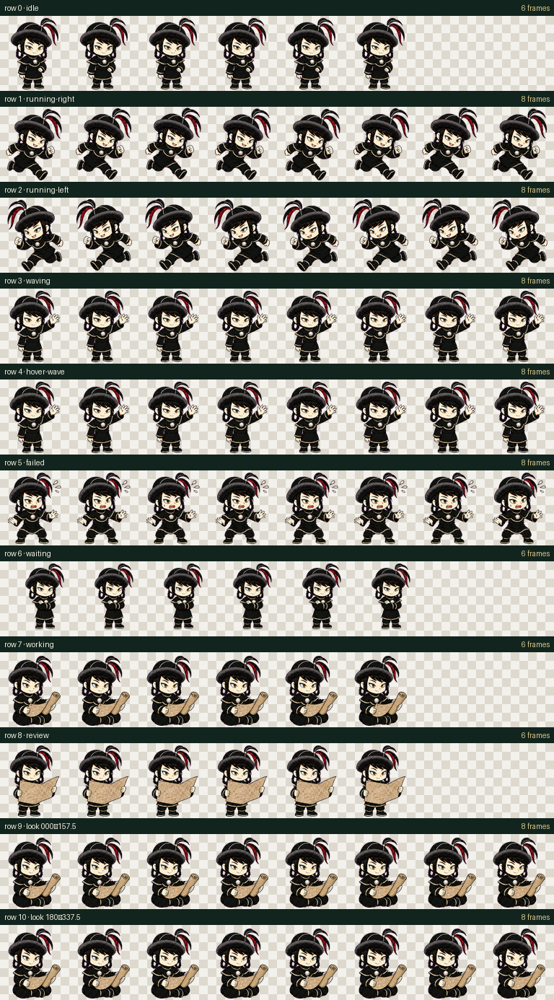

# Batu-chan Codex Pet · 拔都酱桌宠



<p align="center">
  
</p>

## 中文

这是以 tomatosoup 漫画《穹庐下的魔女》（《天幕のジャードゥーガル》）中拔都的形象为灵感制作的非官方 Codex 桌宠。拔都酱身穿西征军装：黑色高领披肩军袍、浅色滚边、胸前圆徽，以及带黑红长缨的宽边军帽。

### 图集规格

- Codex v2 pet atlas
- RGBA WebP，1536 × 2288 像素
- 8 列 × 11 行，单格 192 × 208 像素
- 静态待机、左右跑动、落地挥手、失败、等待、查看地图等状态

### Windows 安装

```powershell
powershell -ExecutionPolicy Bypass -File .\scripts\install.ps1
```

安装后若未立即出现在桌宠列表，请刷新或重启 Codex。

### macOS / Linux 安装

```bash
./scripts/install.sh
```

### 本地重建与验证

```bash
python -m pip install -r requirements.txt
python scripts/build_assets.py
python scripts/validate.py
```

项目包含安装配置、透明动画图集、预览图、图像生成母版、确定性构建脚本与验证报告。

## English

Batu is an unofficial Codex pet inspired by his character design in tomatosoup's manga *A Witch's Life in Mongol* / *Tenmaku no Jaadugar*. This version uses his western-expedition uniform: a black high-neck military robe, piped shoulder mantle, command medallion, and a broad hat with black-and-crimson plumes.

Run `scripts/install.ps1` on Windows or `scripts/install.sh` on macOS/Linux, then refresh or restart Codex. The package uses the Codex v2 8×11 RGBA WebP atlas format.

## Attribution

This is a local, non-commercial fan project. The original manga, character, and associated rights belong to their respective rights holders. It is not affiliated with or endorsed by tomatosoup, Akita Shoten, the animation production committee, or OpenAI.
